# 1.项目介绍
- 系统角色：管理员、普通用户
- 功能模块：管理员（用户管理、名师管理、视频管理、在线学习管理、论坛交流、试卷管理、试题管理、考试管理等），普通用户（查看相关信息、学习、考试相关等功能）
- 技术选型：SSM，vue，uniapp等
- 测试环境：idea2024，HbuilderX，微信开发工具，Maven3，jdk1.8，mysql5.7等
# 2.项目部署
## 2.1 后端部署
- 创建数据库，导入sql
- 通过idea打开项目ssm，根据本地数据库环境配置src/main/resources/config.properties 3-5行
- 配置tomcat，Application context配置为/ssmvd34b，这个路径可以自行修改，同时主要要修改uniapp项目的请求url
- 后端管理web，基于Vue开发，路径为src/main/webapp/admin，你可以通过vscode或者webstorm等IDE工具进行修改，本项目的将编译后的dist直接放在tomcat运行
- 启动tomcat后，管理web：http://localhost:8080/ssmvd34b/admin/dist/index.html， 管理员账号密码：abo/abo， 普通用户自行查看yonghu表（论文示例参考里没有考试的内容，本人在测试的时候完善了考试模块，考试在电脑端进行）
## 2.2 小程序部署
- 首先说明：压缩包内提供的mp-weixin是我通过HbuilderX 编译后的，你可以直接通过微信开发工具打开，如果你想自己修改，请看下面的步骤
- 通过HbuilderX工具打开ssm下的src/main/webapp/front目录
- 修改mainfest.json里的uniapp应用标识和小程序的appid
- 运行到微信小程序即可，登录账号查看yonghu表
# 3.项目部分截图

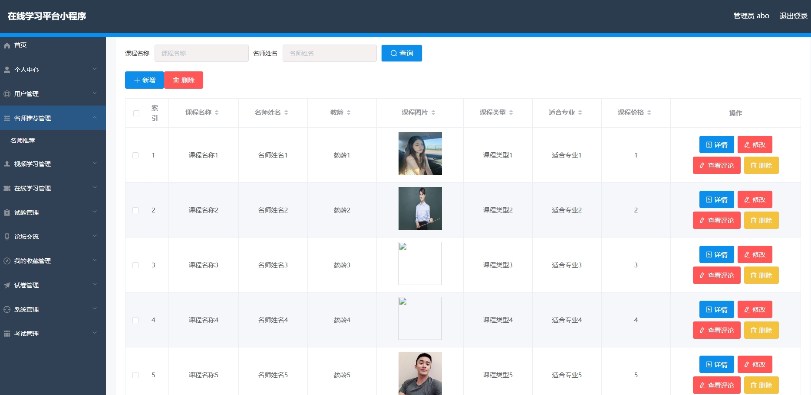
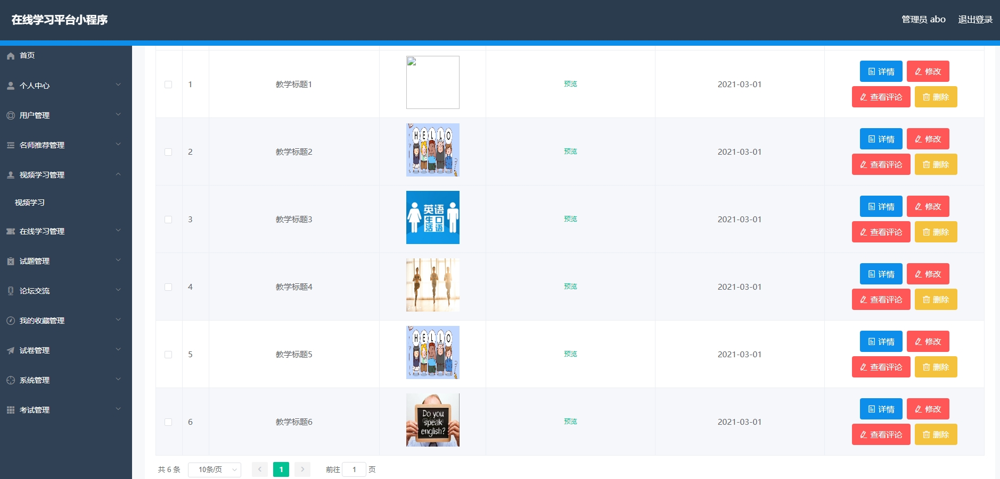
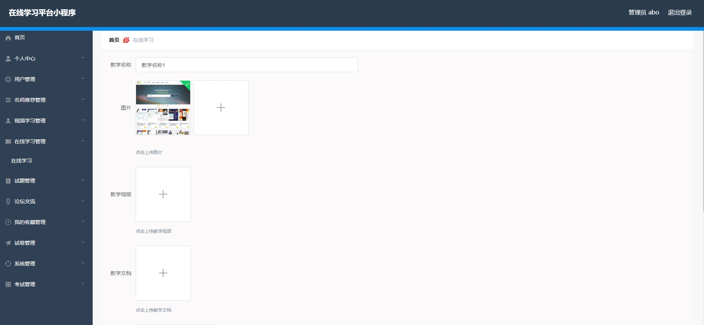
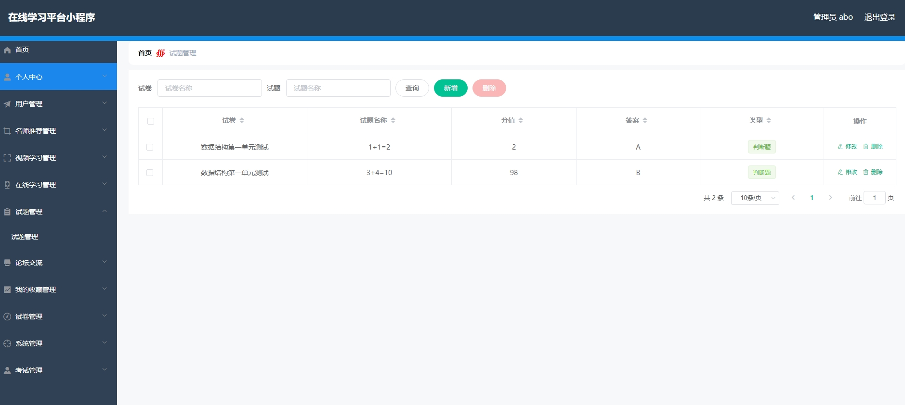
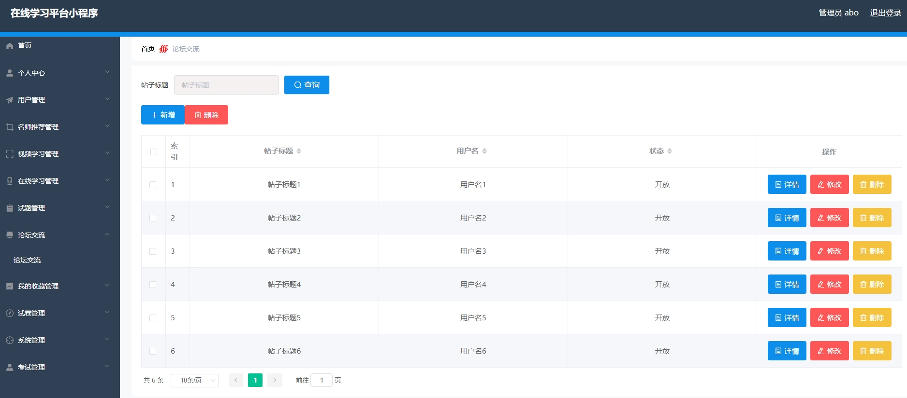
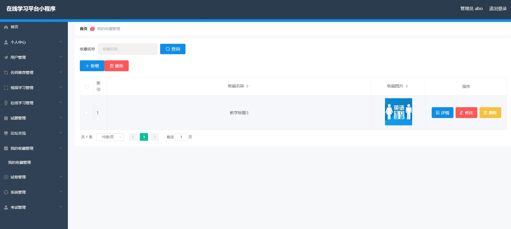
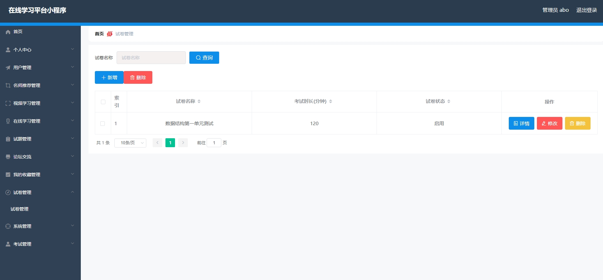
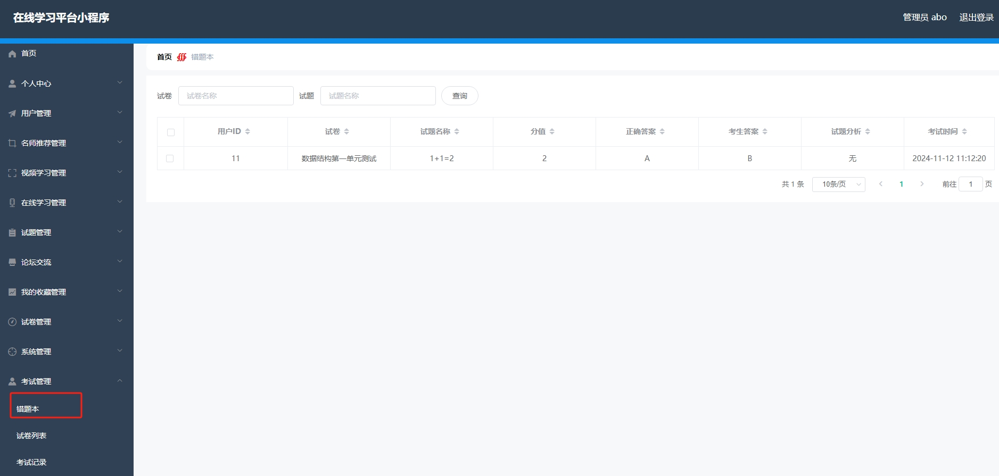

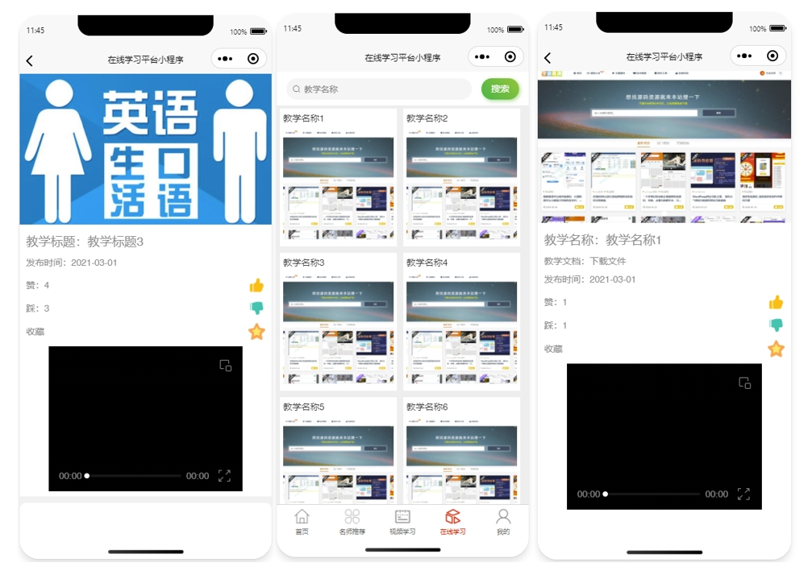
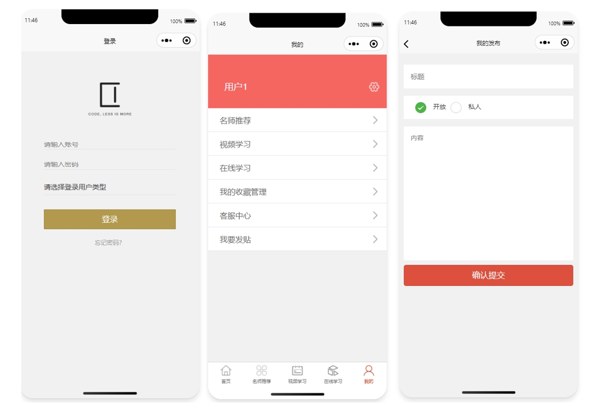
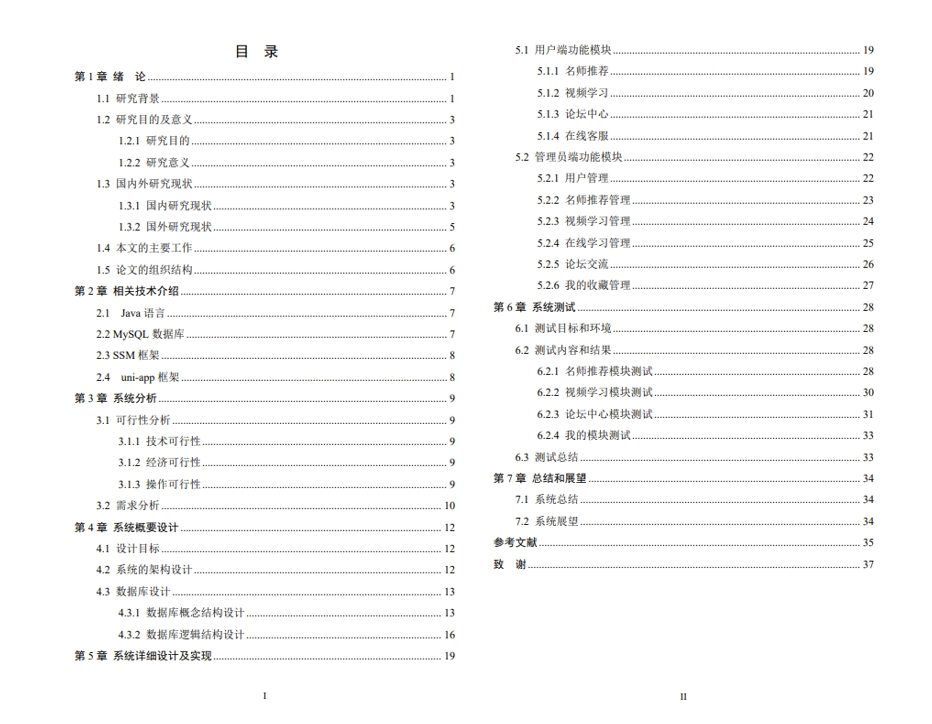

# 4.获取方式
[戳我查看](https://gitee.com/aven999/mall)